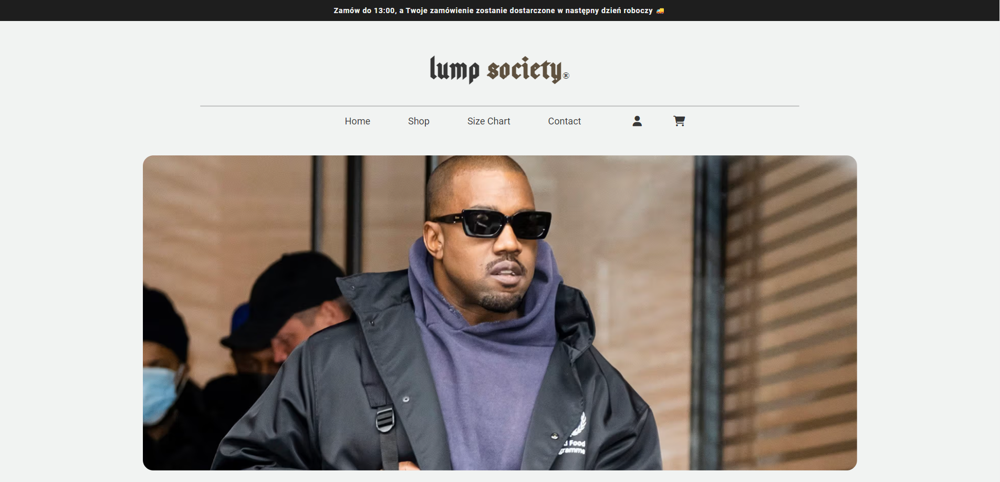
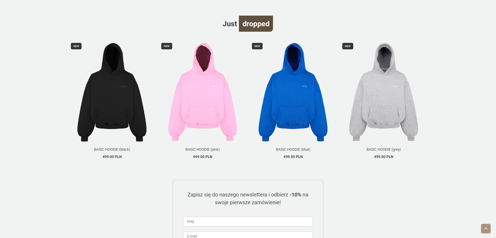

<h1 align="center">Lump Society</h1>

 This is a page made as part of a credit project for school. The site depicts the fictional store LumpSociety 

  

## How to start  

To view the demo you need to go to the link provided below

  

  <a href='http://lumpsociety.infinityfreeapp.com/'>View demo</a>

  

Password to admin panel:

Email: admin@admin.pl

Password: admin

## About The Project

<video width="320" height="240" controls>
  <source src="dist/img/lumpsociety.mp4" type="video/mp4">
</video>

  

The website was made based on the hills.com website design the product images are from hills.com and I have no rights to them PROJECT IS FOR EXERCISE PURPOSE ONLY. 
lumpsociety is a clothing store where users can create an account log in, add items to cart and order them. The store also has a simple admin panel. 

### Built With

HTML
 
SCSS(bootstrap 5.3)
 
JavaScript
 
PHP
 
MySQL

## Contact

Jakub Pachut - jakubpachut@gmail.com

Project Link: https://github.com/Szafter12/LumpSociety
